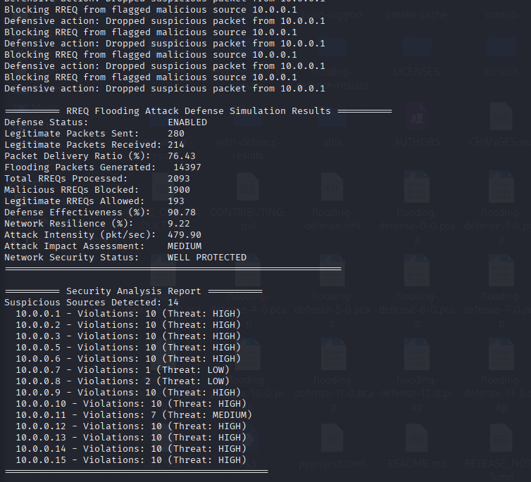
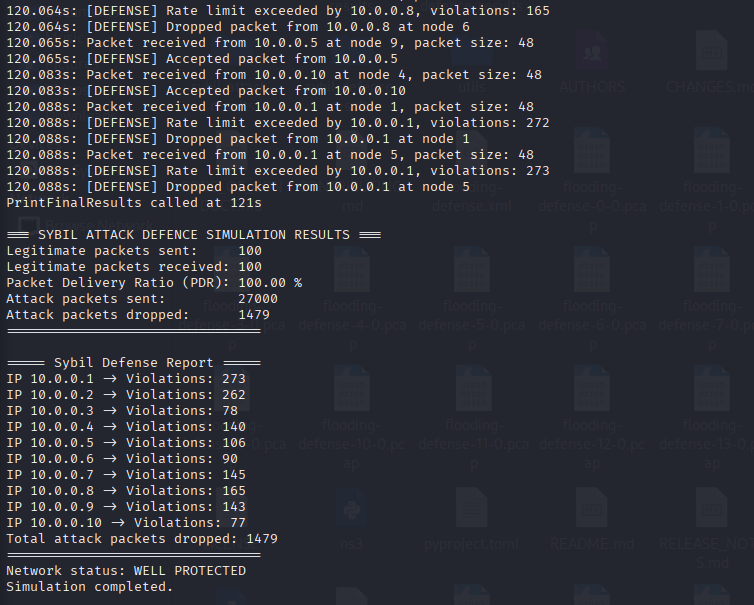

# mannet-attacks-ns3
Comprehensive NS-3 simulation  for MANET security research: RREQ flooding &amp; Sybil identity attacks with advanced defense mechanisms. Includes performance analysis, visualization, and forensic capabilities for network security assessment.

# How the Attack Works and How the Defense Works

## 1. Attack Mechanisms

### RREQ Flooding Attack
- **Concept**: Overwhelm the network routing process by generating a large number of Route Request (RREQ) packets in a Mobile Ad Hoc Network (MANET) using the AODV protocol.
- **Implementation Details**:
  - The attacker node floods the network with RREQ messages at a high rate (e.g., 480 packets/second).
  - Floods include bursts of multiple packets sent rapidly (e.g., 3 packets every 5 ms).
  - Packet destinations are often random or spoofed to increase routing table pollution.
- **Impact**:
  - Consumes bandwidth and node processing resources.
  - Causes congestion and delays legitimate packet delivery.
  - Severely reduces Packet Delivery Ratio (PDR), leading to denial of service.
  
### Sybil Identity Attack
- **Concept**: The attacker forges multiple fake identities (IP addresses) to deceive the network, creating many bogus nodes that participate maliciously in routing or traffic.
- **Implementation Details**:
  - The attacker uses raw sockets or crafted packets with spoofed IPs (e.g., 10.0.0.200 - 10.0.0.205).
  - Cyclically sends attack packets from different spoofed IPs to simulate many distinct malicious nodes.
  - Packet bursts with high frequency designed to flood the network.
- **Impact**:
  - Subverts trust and routing mechanisms by appearing as multiple nodes.
  - Increases network traffic, leading to congestion and packet loss.
  - Degrades network performance drastically (lowers PDR).

---

## 2. Defense Mechanisms

### RREQ Flooding Defense
- **Rate Limiting**:
  - The defense monitors the rate of incoming RREQs per source IP.
  - If a source exceeds a threshold (e.g., 3 RREQs per second), further requests from that source are blocked.
- **Reputation Management**:
  - Maintains violation counters for suspicious sources.
  - Classifies threat levels (High/Medium/Low) based on violations.
  - Persistent offenders are permanently blocked.
- **Real-time Monitoring**:
  - The IPv4 layer hooks into packet reception events to inspect and filter RREQs.
  - Ensures legitimate traffic flow by allowing only conformant request rates.
- **Effect**:
  - Significantly reduces malicious flooding packets reaching the network.
  - Restores legitimate packet delivery rates (PDR improves markedly).

### Sybil Attack Defense
- **Rate and Burst Detection**:
  - Tracks packets per source IP within a sliding time window (e.g., 5 seconds).
  - Limits allowed packet count per IP (e.g., max 3 packets per window).
  - Detects bursts of packets (e.g., 5 packets within 0.5 seconds) for rapid filtering.
- **Violation Counting and Blocking**:
  - Every violation increments a counter for the source IP.
  - Packets from sources violating thresholds are dropped.
- **IP-Agnostic Monitoring**:
  - Defense is effective regardless of spoofed IP identities by detecting traffic anomalies.
- **Effect**:
  - Blocks the majority of Sybil attack packets while preserving legitimate network traffic.
  - Maintains network stability with 100% PDR in simulations despite heavy attack traffic.

---

## Summary

| Aspect            | Attack Characteristics                             | Defense Strategy                                   | Defense Effectiveness                        |
|-------------------|---------------------------------------------------|--------------------------------------------------|----------------------------------------------|
| RREQ Flooding     | High-rate RREQ bursts from attacker nodes         | Rate limiting + reputation management             | >90% attack packets blocked; PDR up to 76%  |
| Sybil Identity    | Multiple spoofed IPs send rapid packet bursts      | Rate + burst detection with violation tracking    | Significant drops of attack packets; 100% PDR |

These mechanisms together provide robust protection for MANETs by identifying and mitigating malicious traffic patterns while allowing legitimate communication to continue uninterrupted.
# Attacks & Defense Results

## Flooding Attack & Defense

## Sybil Attack Results

## Flooding Attack Result

## Sybil Defense Result

