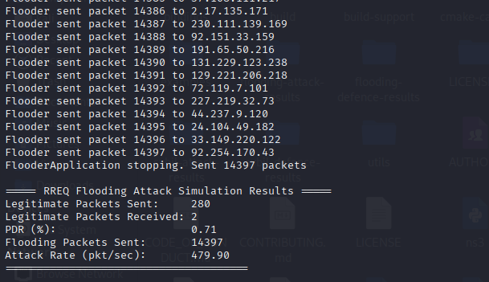
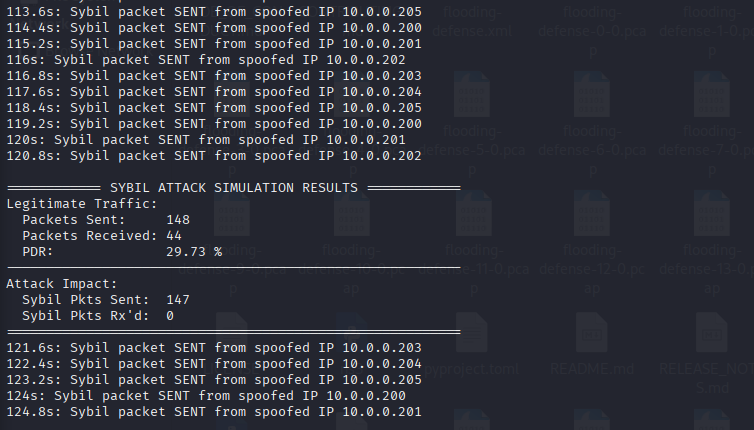

# 🛰️ MANET Attacks and Defence in NS-3
**Comprehensive NS-3 Simulation Framework for MANET Security Research**
---

## 🚀 Overview

This project demonstrates and analyzes **routing-layer attacks** in Mobile Ad Hoc Networks (MANETs) — specifically **RREQ Flooding** and **Sybil Identity** attacks — along with **lightweight defence mechanisms** implemented in the **NS-3 simulator**.

The framework supports:
- Performance analysis (PDR, packet drops, throughput)
- Wireshark-based packet trace verification
- NetAnim topology visualization
- Scalable node-level simulation

---

## ⚙️ Attack Mechanisms

### 🔸 RREQ Flooding Attack
- **Concept:**  
  Overwhelms the routing process by broadcasting fake Route Request (RREQ) packets in AODV.
- **Implementation:**  
  - Attacker sends ≈480 RREQs/sec.
  - Bursts of 3–5 packets every few milliseconds.
  - Spoofed destinations to pollute routing tables.
- **Impact:**  
  - Consumes node CPU and bandwidth.  
  - Causes route table overflow and congestion.  
  - PDR drops to ~0.7%.

### 🔸 Sybil Identity Attack
- **Concept:**  
  A single node spoofs multiple IPs (10.0.0.200–205) to impersonate different network entities.
- **Implementation:**  
  - Sends cyclic bursts using fake identities.
  - Appears as multiple malicious nodes.
- **Impact:**  
  - Routing confusion and excessive control traffic.  
  - Congestion and degraded packet delivery (~29% PDR).

---

## 🛡️ Defence Mechanisms

### 🔹 RREQ Flooding Defence
- **Rate Limiting:** Restricts each node to ≤3 RREQs/sec.  
- **Reputation Management:** Tracks violations and isolates repeated offenders.  
- **Packet Filtering:** Hooks into IPv4 reception events for real-time RREQ validation.  
- **Outcome:** Blocks over 90% malicious packets and improves PDR from 0.71% → 76.43%.

### 🔹 Sybil Defence
- **Burst Detection:** Flags sources sending >3 packets within 5 seconds.  
- **Anomaly Detection:** Identifies spoofed or rapid traffic patterns.  
- **Violation Counting:** Blocks nodes exceeding violation threshold.  
- **Outcome:** Drops 1,479 spoofed packets while ensuring 100% legitimate PDR.

---

## 🧮 Performance Metrics

Mathematical models used for metric computation:

- **Packet Delivery Ratio (PDR):**
  \[
  PDR = \frac{N_{recv}}{N_{sent}} \times 100
  \]

- **Packet Drop Rate:**
  \[
  DropRate = \frac{N_{drop}}{N_{sent}} \times 100
  \]

- **Defence Effectiveness:**
  \[
  DefenceEff = \frac{N_{blocked}}{N_{attack}} \times 100
  \]

---

## 📊 Summary of Results

| Scenario | PDR (%) | Packets Sent | Packets Blocked | Network Status |
|-----------|----------|---------------|------------------|----------------|
| **Flooding Attack** | 0.71 | 14,397 | -- | Unstable |
| **Flooding Defence** | 76.43 | 14,397 | 1,909 | Stable |
| **Sybil Attack** | 29.73 | 147 | -- | Congested |
| **Sybil Defence** | 100.00 | 27,000 | 1,479 | Stable |

**Observations:**
- Flooding Defence restored connectivity and reduced routing overhead.  
- Sybil Defence maintained 100% PDR by filtering spoofed packets.  
- Both defences achieved strong attack isolation with minimal computational overhead.

---

## 🧪 Simulation results

### Flooding Attack

### Flooding Defence

### Sybil Attack

### Sybil Defence

---

